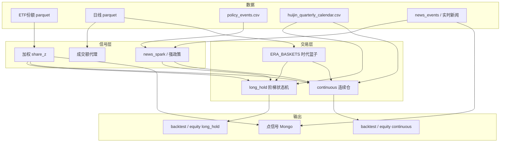

# 国家队因子（national_team）技术文档

> 因子 ID：`national_team`  
> 实现：`app/services/factors/national_team.py`  
> 服务分发：`app/services/factors_service.py`  
> API：`POST /api/factors/national_team/compute`  
> 回测脚本：`scripts/backtest_national_team_factor.py`  
> 数据目录：`data/factors/`

本文描述「国家队 / 中央汇金」风格因子的设计目标、数据流、信号与仓位逻辑、回测口径，以及在 jx 中的自动运行方式。

---

## 1. 目标与设计原则

### 1.1 要解决什么问题

捕捉 **中央汇金等国家队** 在 A 股宽基 ETF 上的增减仓行为，并据此给出：

1. **点信号**（实时/按日）：`buy` / `sell` / `neutral`，供 Factors 页面与下游使用  
2. **日度战役仓位**（回测）：两套仓位逻辑可选  
   - `long_hold`：阶梯仓（半仓试探 → 满仓粘持 → 减仓/冷却）  
   - `continuous`：连续仓（底仓 10%，随 `share_z` 灵活加减，可反复进出）

### 1.2 核心原则：信号与交易分离

| 层 | 做什么 | 标的 |
|----|--------|------|
| **信号层** | 判断汇金是否在加/减仓 | 始终用汇金高占比沪深300 ETF 份额 |
| **交易层** | 实际持仓收益 | 按时代切换篮子（早期宽基 → 近年银行+科创） |

原因：汇金真实持仓结构随市场阶段变化，但 **份额最干净的观测窗口** 长期落在几只沪深300 ETF 上；交易端则应跟随当时更有效的风格。

---

## 2. 信号层：份额篮子

加权合成（权重可在代码常量中调整）：

| 代码 | 名称 | 权重 |
|------|------|------|
| `510300` | 华泰柏瑞沪深300ETF | 0.60 |
| `510310` | 易方达沪深300ETF | 0.22 |
| `510330` | 华夏沪深300ETF | 0.18 |

常量：`HUIJIN_SIGNAL_ETFS`。

份额序列来自本地缓存 `data/factors/{code}_share.parquet`（优先），必要时用上交所规模接口补近日数据（`fetch_etf_share_series`）。

日度因子中对加权份额取滚动 z-score，得到 **`share_z`**（主信号）。无份额时回退到成交额带符号资金流代理 `proxy`（阻尼使用）。

份额历史可视化：`huijin_etf_share_curve.png`（绝对份额 / 相对指数 / `share_z`）。

---

## 3. 交易层：时代篮子 `ERA_BASKETS`

| 时代 | 区间 | 交易篮子 | 说明 |
|------|------|----------|------|
| `sse50` | 2012-01-01 ~ 2016-12-31 | `000016` 100% | 早期宽基（上证50） |
| `csi300` | 2017-01-01 ~ 2023-09-30 | `000300` 100% | 沪深300 |
| `bank_star` | 2023-10-01 ~ | `BANK4` 55% + `000688` 45% | 银行合成 + 科创50 |

价格来自 `data/factors/{symbol}_daily.parquet`；ETF 可回退东方财富直连/akshare。

时代边界 **不重置净值**，权重按日切换后连续复利。

---

## 4. 两类输出

### 4.1 点信号 `compute_national_team_signal`

供 API / 启动自动刷新使用（**轻量**，不是全历史回测仓位）。

**输入参数（可选，存于 Mongo `factors.params`）**

| 参数 | 默认 | 含义 |
|------|------|------|
| `etf_code` | `510300` | 主观测 ETF |
| `share_lookback_days` | 5 | 份额变化回望天数 |
| `share_buy_threshold` | 0.005 | 增仓阈值（相对变化） |
| `share_sell_threshold` | -0.005 | 减仓阈值 |

**合成**

- 有份额：`share_score` 由回望期份额变化映射到约 `[-1, 1]`  
- 无份额：用带符号成交额滚动和的 z-score 代理  
- 新闻关键词打分 `news_score`（稳市/汇金/护盘 vs 减持等）  
- 可选国诚 CSV：`data/factors/guocheng_signals.csv`（`date,direction`）

权重：有国诚时 `0.5·share + 0.3·news + 0.2·guocheng`；否则 `0.65·share + 0.35·news`。

| `value` | `signal` |
|---------|----------|
| ≥ 0.25 | `buy` |
| ≤ -0.25 | `sell` |
| 其它 | `neutral` |

结果写入 Mongo：`factor_signals` 集合，并更新 `factors` 文档的 `latest_signal` / `latest_value` / `latest_asof`。

### 4.2 日度因子 `build_national_team_daily_factor`（回测）

默认 `use_era_universe=True`：

1. 拼时代交易面板（`close` / `bench_ret` / `amount`）  
2. 按时代信号篮子算 `share_z`  
3. `factor_raw ≈ 0.85·share_z + 0.15·proxy`（有份额时）  
4. 叠加国诚得分 → `factor`  
5. 构建 `news_spark`（精选新闻 + 强政策 + 可选恐慌）  
6. 加载政策买卖/风险序列、汇金季报确认序列  
7. `apply_position_logic(...)` 按 `position_logic` 生成仓位

仓位 T+1 生效：`position_exec = position.shift(1)`，`strategy_ret = position_exec * bench_ret`。

---

## 5. 仓位逻辑 A：`long_hold`（默认主产物）

状态流转：

```text
OFF ──(强政策/精选新闻火花)──► PROBE(半仓)
PROBE ──(share_z 确认)──► HOLD(满仓)
HOLD ──(份额收缩 / 政策风险 / 指定窗口回撤)──► REDUCE 或 COOLDOWN
COOLDOWN ──(冷却结束)──► OFF
```

特点：**低频、粘持、接近空仓/满仓阶梯**（中间多为 0 / 0.5 / 1.0）。

### 5.1 开仓

- **默认 `allow_panic_entry=False`**：不做「暴跌即开仓」  
- 开仓火花来自：
  - 精选新闻事件 CSV：`data/factors/national_team_news_events.csv`
  - **强政策**（`policy_events.csv` 中 `direction=buy` 且 `strength ≥ 1.0`）
  - 可选国诚 buy
- 弱政策（`0 < strength < 1`）只作 **持仓延长**，不开仓

### 5.2 确认与减仓（回测默认阈值）

| 参数 | 默认 | 作用 |
|------|------|------|
| `confirm_share_z` | 0.03 | 份额确认 → 满仓 |
| `soft_reduce_share_z` | -0.14 | 软减仓线 → REDUCE |
| `reduce_share_z` | -0.28 | 硬减仓线 → 清仓/冷却 |
| `probe_size` / `hold_size` / `reduce_size` | 0.5 / 1.0 / 0.5 | 仓位比例 |
| `min_hold_confirmed` | 160 | 确认后最短持仓（交易日） |
| `reduce_confirm_days` | 50 | 减仓用滚动均值窗口 |
| `cooldown_bars` | 5 | 冷却交易日 |

### 5.3 汇金季报日历

- 数据：`data/factors/huijin_quarterly_calendar.csv`（可由 `scripts/build_huijin_quarterly_calendar.py` 生成）  
- 作用：**只确认/延长持仓，不单独开仓**  
- 开关：`use_huijin_calendar`（默认 True）

### 5.4 政策事件

文件：`data/factors/policy_events.csv`

列：`date,direction,strength,note`

| direction | 含义 |
|-----------|------|
| `buy` | 稳市/护盘类；强度 ≥1 可作开仓火花 |
| `sell` / `risk` | 风险退出（如清配资、汇金减持公告等） |

开关：`use_policy_events`（默认 True）。

### 5.5 回撤止损（分窗口）

默认近年 **关闭**（阈值约 -0.99）；**仅 2018** 启用较严战役峰值回撤止损（约 -10%），避免救市后粘持穿越熊市。参数：`bear_window_*` / `episode_dd_*`。

---

## 6. 仓位逻辑 B：`continuous`（连续仓 / 灵活版）

实现：`_positions_continuous`；CLI：`--logic continuous` 或与阶梯仓对比 `--logic compare`。

### 6.1 设计意图

相对 `long_hold` 的「空仓/半仓/满仓」阶梯：

- **底仓 10%**（`cont_campaign_floor=0.10`）  
- **仓位随 `share_z` 连续变化**，EMA 很短，跟踪灵活  
- **允许更高交易频次**：份额信号可反复开平，不强制长粘持  

### 6.2 状态

```text
OFF / COOLDOWN
  │  强政策/精选新闻，或 share_z ≥ cont_reentry_z
  ▼
ACTIVE  ←→ 仓位 ∈ [0, 1] 连续跟踪 share_z
  │  软退出（映射到 0）/ 硬退出（政策风险、深缩份额、回撤）
  ▼
OFF / COOLDOWN
```

### 6.3 仓位映射规则

设 `z_lo=cont_z_lo`，`z_hi=cont_z_hi`，`floor=cont_campaign_floor`，`exit_z=cont_exit_z`：

| `share_z` 区间 | 目标仓位 |
|----------------|----------|
| `≥ z_hi` | `1.0`（满仓） |
| `[z_lo, z_hi]` | 线性映射到 `[floor, 1]`，并保底 `floor` |
| `(exit_z, z_lo)` | 底仓从 `floor` **滑降到 0** |
| `≤ exit_z`（滚动确认） | 硬退出 → 冷却 |

再经 EMA（`cont_smooth`，默认 **2**）平滑得到当日仓位。

软退出：目标已到 0 且平滑仓位很轻 → 直接 `OFF`（短冷却）。  
硬退出：政策风险、汇金确认为负、滚动 `share_z ≤ exit_z`、战役回撤止损。

### 6.4 开仓条件

任一即可（在无风险阻断时）：

1. 精选新闻 / 强政策火花（与 `long_hold` 相同）  
2. **`cont_allow_signal_reentry=True`（默认）** 且 `share_z ≥ cont_reentry_z`（默认 0.03）  

### 6.5 默认参数

| 参数 | 默认 | 含义 |
|------|------|------|
| `cont_campaign_floor` | **0.10** | 战役底仓 |
| `cont_z_lo` | -0.15 | 映射下沿（以下开始降底仓） |
| `cont_z_hi` | 0.20 | 映射上沿（达满仓） |
| `cont_smooth` | **2** | EMA 跨度（越小越跟手） |
| `cont_exit_z` | -0.30 | 硬退出线 |
| `cont_exit_confirm_days` | 8 | 硬退出滚动确认窗口 |
| `cont_reentry_z` | 0.03 | 份额再入场阈值 |
| `cont_allow_signal_reentry` | True | 允许份额信号反复开仓 |
| `cont_cooldown_bars` | 2 | 连续仓专用冷却（不影响 `long_hold` 的 `cooldown_bars`） |
| `cont_max_pos` | 1.0 | 仓位上限 |

### 6.6 与 `long_hold` 最新回测对比

口径：`2012-05-28` → `2026-07-24`，时代篮子交易，T+1，未计成本。

| 指标 | `long_hold` | `continuous` |
|------|-------------|--------------|
| 累计收益 | **+126.1%** | +119.3% |
| 年化 | **6.16%** | 5.92% |
| 夏普 | 0.38 | **0.43** |
| 最大回撤 | -34.0% | **-26.7%** |
| 平均仓位（含空仓） | 0.64 | 0.49 |
| 有仓时中位仓位 | 1.00 | 0.77 |
| 开平次数（往返） | 6 | **36** |
| 中位持仓交易日 | 425 | 47 |

解读：

- `long_hold`：收益略高，靠长粘持吃大段行情，回撤更深、交易极少  
- `continuous`：收益接近，**夏普更好、回撤更浅**，仓位更细、交易更勤  

主回测 CSV/净值图默认仍写 `long_hold`；连续版另存：

- `data/factors/national_team_backtest_continuous.csv`  
- `data/factors/national_team_equity_curve_continuous.png`  

对比一次：

```powershell
python scripts\backtest_national_team_factor.py --logic compare --mode long_flat
```

---

## 7. 数据产物一览

| 路径 | 说明 |
|------|------|
| `data/factors/510300_share.parquet` 等 | ETF 份额缓存 |
| `data/factors/510300_daily.parquet` 等 | 行情缓存 |
| `data/factors/BANK4_daily.parquet` | 银行合成指数 |
| `data/factors/policy_events.csv` | 政策日历 |
| `data/factors/huijin_quarterly_calendar.csv` | 汇金季报公告对齐 |
| `data/factors/national_team_news_events.csv` | 精选新闻事件 |
| `data/factors/guocheng_signals.csv` | 可选人工标注 |
| `data/factors/national_team_backtest.csv/json` | 回测明细与摘要（默认主逻辑） |
| `data/factors/national_team_equity_curve.png` | 主逻辑净值+仓位图 |
| `data/factors/national_team_backtest_continuous.csv` | 连续仓明细 |
| `data/factors/national_team_equity_curve_continuous.png` | 连续仓净值+仓位图 |
| `data/factors/huijin_etf_share_curve.png` | 份额历史曲线 |
| `data/factors/huijin_etf_share_history.csv` | 份额历史面板 |

---

## 8. API 与程序调用

### 8.1 HTTP

```http
POST /api/factors/national_team/compute?asof=2026-07-24
```

需登录。响应含 `signal`、`value`、`components`、`note`。

### 8.2 Python（服务层）

```python
from app.services.factors_service import factors_service

result = await factors_service.compute_signal("national_team")
# result["signal"] in {"buy","sell","neutral"}
```

### 8.3 回测 CLI

```powershell
cd d:\cursor_space\jx
$env:PYTHONPATH="d:\cursor_space\jx"

# 阶梯粘持（默认主产物）
python scripts\backtest_national_team_factor.py --logic long_hold --mode long_flat

# 连续仓（底仓10%、灵活跟踪）
python scripts\backtest_national_team_factor.py --logic continuous --mode long_flat

# 二者对比（json 含两边结果；连续版另写 continuous 文件）
python scripts\backtest_national_team_factor.py --logic compare --mode long_flat
```

其它：`--logic threshold`（旧日频滞回）、`--logic episode`（旧战役）、`--logic both`（long_hold+episode）。

### 8.4 汇金日历刷新

```powershell
python scripts\build_huijin_quarterly_calendar.py --refresh
```

---

## 9. jx 启动时自动运行

每次启动 FastAPI 后端（`python -m app` / Docker `uvicorn app.main:app`）会：

1. 注册内置因子（若不存在）  
2. **异步刷新** `national_team` **点信号**并写入 Mongo（不阻塞启动）  
3. （可选）按 Cron 日更一次  

> 启动自动跑的是点信号，**不是** `long_hold`/`continuous` 全历史回测。

### 9.1 配置项（`.env`）

| 变量 | 默认 | 含义 |
|------|------|------|
| `NATIONAL_TEAM_FACTOR_REFRESH_ON_STARTUP` | `true` | 启动后立即算一次点信号 |
| `NATIONAL_TEAM_FACTOR_REFRESH_ENABLED` | `true` | 是否注册定时刷新 |
| `NATIONAL_TEAM_FACTOR_REFRESH_CRON` | `30 18 * * 1-5` | 工作日 18:30 刷新 |

```env
NATIONAL_TEAM_FACTOR_REFRESH_ON_STARTUP=false
```

实现：`app/main.py` → `lifespan`；配置：`app/core/config.py` → `Settings`。

---

## 10. 架构示意



---

## 11. 解读信号时的注意点

1. **政策口风 ≠ 立刻满仓**：弱稳市话术在 `long_hold` 里只延长/不入场；`continuous` 可用份额上穿再入场，但仍需警惕噪声。  
2. **份额跳变**：部分日期份额更新稀疏或跳变大，`share_z` 可能单日剧烈波动；连续仓已用短 EMA，但仍可能日内级换手偏多。  
3. **点信号 vs 回测仓位**：API 点信号偏「份额+新闻加权」；回测两套仓位机更结构化，不必与点信号逐日一致。  
4. **日历维护**：`policy_events.csv` 需人工/半自动补新事件，否则系统看不见新的强政策火花。  
5. **2015–2017**：`long_hold` 在 2015-07 救市开仓后以粘持为主，期间有半仓 REDUCE，但很少清仓；不等于「国家队三年从未减仓」，而是策略阈值偏粘。  

---

## 12. 相关文档与代码索引

| 资源 | 路径 |
|------|------|
| 三模块总览（简版） | `docs/features/leads-factors-investments.md` |
| 因子实现 | `app/services/factors/national_team.py` |
| 服务注册 | `app/services/factors_service.py` |
| 路由 | `app/routers/factors.py` |
| 启动钩子 | `app/main.py`（`lifespan`） |
| 回测脚本 | `scripts/backtest_national_team_factor.py` |
